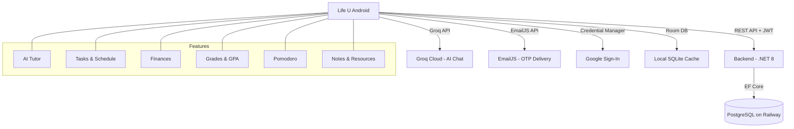

# Life U

<p align="center">
  
</p>

<p align="center">
  Intelligent student companion for studying, scheduling, finances, and AI help.
</p>

<p align="center">
  
  
  
  
  
  
</p>

## What it does

Life U brings your student tools into one app:

- **AI Tutor** — Chat with U (Groq-powered) for study help, lecture explanations, quizzes, and mental health support
- **Tasks & Schedule** — Manage assignments with priorities, weekly class schedule, and deadline alerts
- **Pomodoro Timer** — Focus sessions with work/break cycles and study hour tracking
- **GPA & Grades** — Track courses, credit hours, and calculate GPA
- **Budget & Finances** — Log income/expenses, category breakdown, budget limits with progress indicators
- **Notes & Resources** — Save study notes, attach files, and manage learning resources
- **Exam Tracker** — Track upcoming exams with dates, times, and locations
- **Profile** — University info, avatar, dark mode theme toggle
- **Google Sign-In** — One-tap authentication via Credential Manager
- **Forgot Password** — OTP email verification via EmailJS

## Architecture



## Tech stack

| Layer | Technology |
|-------|-----------|
| Language | Kotlin |
| UI | Jetpack Compose + Material 3 |
| Local DB | Room (SQLite) |
| Networking | Retrofit + OkHttp |
| Image Loading | Coil |
| AI Chat | Groq API (LLaMA 3) |
| Authentication | Google Credential Manager + JWT |
| OTP Email | EmailJS API |
| Persistence | SharedPreferences (auth, onboarding) |
| Backend | .NET 8 + PostgreSQL (Railway) |

## Setup

### Prerequisites
- Android Studio (latest stable)
- Kotlin 1.9+
- A device or emulator (min SDK 24)

### 1. Clone the repository

```bash
git clone https://github.com/Adham14266/Life_U.git
cd Life_U
```

### 2. Create `.env` file

Create a `.env` file in the project root with the following keys:

```env
GROQ_API_KEY=gsk_your_groq_api_key
GOOGLE_WEB_CLIENT_ID=your_web_client_id.apps.googleusercontent.com
BACKEND_URL=https://backend-production-85b13.up.railway.app/
EMAILJS_SERVICE_ID=service_xxxxxxx
EMAILJS_TEMPLATE_ID=template_xxxxxxx
EMAILJS_PUBLIC_KEY=your_emailjs_public_key
```

### 3. Place `google-services.json`

Download from [Firebase Console](https://console.firebase.google.com/) and place at `app/google-services.json`.

### 4. Build and run

```bash
# Debug APK
./gradlew assembleDebug

# Release APK
./gradlew assembleRelease
```

APK output: `app/build/outputs/apk/debug/app-debug.apk`

## Backend Integration

The app syncs data with a .NET 8 backend deployed on Railway:

| Endpoint | Method | Description |
|----------|--------|-------------|
| `/api/Auth/register` | POST | Create account |
| `/api/Auth/login` | POST | Email/password login |
| `/api/Auth/google-login` | POST | Google Sign-In |
| `/api/Auth/reset-password` | POST | Reset password |
| `/api/Auth/profile` | GET | Get user profile |
| `/api/Auth/profile` | PUT | Update profile |
| `/api/Tasks` | CRUD | Task management |
| `/api/Classes` | CRUD | Class schedule |
| `/api/Notes` | CRUD | Study notes |
| `/api/Grades` | CRUD | Course grades |
| `/api/Resources` | CRUD | Study resources |
| `/api/Transactions` | CRUD | Finance transactions |
| `/api/Subjects` | CRUD | Subject management |

## Features

### AI Tutor (U)
Four chat modes powered by Groq:
- **General** — Study help, flashcards, concept explanations
- **Explain Lecture** — Break down complex topics with analogies
- **Quiz** — Generate practice exams from study materials
- **Mental Health** — Wellness companion with stress-relief techniques

Supports file/image attachments for analysis.

### Pomodoro Focus Timer
- Configurable work/break durations
- Auto-advance between focus and break sessions
- Study hour tracking synced to profile
- Session history

### Finance Tracker
- Income and expense logging
- Category breakdown (Food, Housing, Transport, Books/Other)
- Budget limit with progress indicator
- Donut chart visualization

## Project structure

```text
app/src/main/java/com/example/
  data/
    api/              # Retrofit API service, DTOs
    local/            # Room database, DAOs, entities
    repository/       # SyncedStudyRepository (local + remote)
  ui/
    screens/          # Compose screens (Login, Dashboard, Tutor, etc.)
    theme/            # Material 3 theme, colors, typography
    viewmodel/        # MainViewModel (auth, navigation, state)
  notifications/      # Notification channels and helpers
```

## Team

| Name | Role |
|------|------|
| Adham Sayed | Software Engineer |
| Omar Nagi | Software Engineer |
| Youssef Atef | Software Engineer |
| Omar Ahmed | Software Engineer |
| Adham Elhadad | Software Engineer |

---

<div align="center">

### Built with ❤️ for students everywhere

</div>
