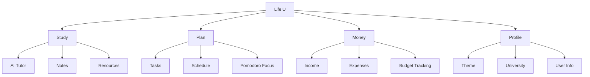
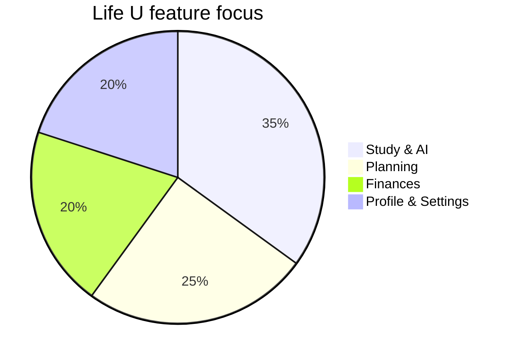

# Life U

  

  Intelligent student companion for studying, scheduling, finances, and AI help.

  
  
  
  
  

## What it does

Life U brings your student tools into one app:

- AI tutor chat for study help
- Tasks and weekly schedule
- GPA and grade tracking
- Budget and expense tracking
- Notes and resource vault
- Profile and theme settings

## Beautiful overview

## Tech stack

- Kotlin
- Jetpack Compose
- Material 3
- Room
- Retrofit / OkHttp
- Coil
- Firebase AI

## Run locally

1. Open the project in Android Studio.
2. Create a `.env` file in the project root.
3. Add `GEMINI_API_KEY` to `.env`.
4. Run the app on an emulator or device.

## Notes

- The app icon has been updated to the new Life U design.
- Input validation is enabled across key forms.

